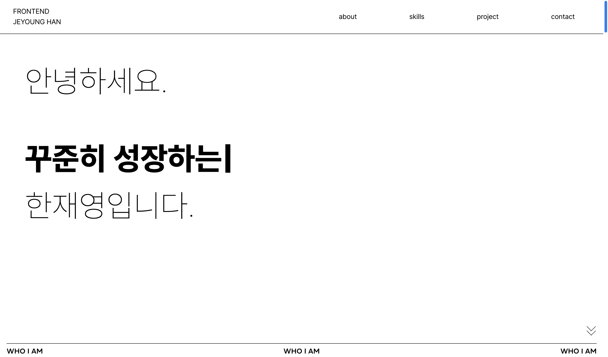

# 2024 Frontend Portfolio

## 목표

- 수업에서 배운 것을 최대한 활용하며 작업한다.
- 드물게 익혔던 부분도 익숙하게 사용할 수 있도록 한다.
- 오류와 타협하지 않고 새로운 기술이 필요하다면 따로 검색하고 공부하여 문제를 해결할 수 있도록 한다.

## 디렉토리 구조

- [Notion directory](https://www.notion.so/Portfolio-cb9c15db223e4e5891b19c6177d7159c?pvs=4#37188eaf914e41a596ed1cef5c8c784f)

## 사용 기술

- stack tools: JavaScript, React, SCSS
- other tools: pigma, Git, GitHub, GitHub Pages

## 페이지 구성

- 공통 가이드라인: 사이즈 (폰트 및 해상도)
  - Mobile: 380px(아이폰12pro)
  - PC: 1280px 작업
  - 브레이크 포인트: 640px
  - font size: rem 기준
  - image size: % 기준
- CSS
  - SASS로 style 작업 진행.
  - 공통 style 변수로 만들어 작업.
  - 타입 선택자보다 클래스명을 활용하여 작성.
  - 네이밍은 케밥 표기법으로 작성.
    `header-wrapper (o) header-container (o)`
- React(JavaScript)
  - 변수 선언 시, 지역변수로 작성 (const 우선 작성)
  - 네이밍은 카멜 표기법을 적용.
    `headerWrapper(o) aboutBtn(o)`

## 발생 이슈 및 해결 방법

### ❓문제 1: 스크롤 이벤트가 자연스럽지 않다 ?

<aside style="background-color: #d8d8d8; padding: 5px">
💡 스크롤 시 해당 컴퍼넌트가 자연스럽게 opacity효과를 주고 싶은데 잘 안된다.

❕scrollY값을 제어하는 문제 인것 같은데, 아직 학습이 부족하여 가능한 범위로만 표현했다.. 계속 공부해보면서 완벽 구현을 해볼 예정.

</aside>

### ❓문제 2: build 후 업로드하였는데 제대로 배포가 되지 않는다 ?

<aside style="background-color: #d8d8d8">
💡 새로 작업한 파일을 배포하였는데, 계속 예전 버전으로 보인다. 전체 파일을 지워보고 GitHub 사이트에서 직접 올려도 봤는데 파일 크기 이슈로 올라가지 않았다. 충돌이 나서 해결하다가 다 지워져 버렸다...

❕`npm run build` 폴더로 빌드 후에 `npm run deploy` 로컬 build폴더를 gh-pages 브랜치로 업로드해야하는데 이걸 놓쳤다..

</aside>

### ❓문제 3: 영상이 움직이지 않는다 ?

<aside style="background-color: #d8d8d8">
💡 마우스 오버하면 영상이 재생되도록 했으나 제대로 작동하지 않는다.

❕자바스크립트가 부족한 나의 탓,, 아직 해결 중입니다.

</aside>

## Time-Line

#### 240224
- 일부 내용 업데이트 및 수정
  - portfolio : 개인 프로젝트 컴퍼넌트 추가
  - 자기소개 내용 수정
  - 이력서 링크 페이지 추가
  - 클릭으로 이메일 바로 보내기 추가

#### 230115

- 인천공항 주차 예약 안내 : 개인 프로젝트 컴퍼넌트 추가

#### 230105

- 피드백3
  - gif -> 영상으로 변경
  - 깃허브 링크는 리드미 타이틀 링크로 수정.

#### 230104

- 제출한 프로젝트 완료보고서 정리필요
  - 누띠:
  - 기획 의도 목표:
    - 백앤드를 이용한 회원가입 -> 익스프레스를 이용한~
  - 사용기술 1) 프론트앤드는 잘 정리했는데, 백앤드는 나열만 되어있음. 크게 묶어서 다시 정리(node/DB/배포)
  - 작업 시 문제 해결 방법 :
  - 설명을 한눈에 파악하기 쉽게 코드 이미지 첨부. 모든 오류에 넣을 필요는 없음. 배운점이 있다거나 중요하게 생각한 오류의 코드 첨부가 좋음.
  - 작성은 잘 했으나, 타이틀 구분이 명확하지 않아서 아쉬움.
  - 프로젝트 완료 리뷰:
  - 내용이 너무 길고 정리가 안되어 있음.
  - 리스트 형태로 정리하거나 문장을 짧게 정리.
  - 아쉬운 부분/ 잘한 부분 리스트로 정리하고 최종 완료 리뷰 로 마무리하는 것도 좋음.

#### 230103

- 피드백2
  - [x] 글씨 더 키울것 (모바일 너무 작음)
  - [x] skills 스티키 적용 꼭 할 것
  - [x] skills 내용 더 추가
  - [x] 전체적으로 재미요소 이벤트 추가 ~~왠지 부족한 느낌,,~~(완)
  - [x] 전체적으로 중심이 왼쪽으로 쏠려있어서 왼쪽 여백 줘서 균형 맞출것 ~~모바일 중앙으로 맞춤~~(완)
  - [x] 프로젝트로 연결 1) pdf 또는 2)gitHub

#### 230102

- 피드백1

  - 최초 디자인과 너무 다른 느낌. ~~미완성~~(완)
  - 기본 폰트 사이즈 너무 작음. 정렬 수정 할 것.
  - 간단한 스크롤 이벤트, 마우스 이벤트 효과 필요.
  - 언어의 아이덴티티 맞춰서 써줄것. 자바스크립트 틀렸음.
  - 반응형 리액트쿼리, css쿼리 적용

- (나도 참고할만한)다른 학생 피드백

  - 스티키..효과 추천(고급, 세련)
  - 모션을 넣어주는 게 요즘 트렌드
  - 설명페이지는 깃허브 리드미 or 서브페이지 선택 -> 시간없으니까 리드미 추천
  - 고정 스크롤 페이지는 앞으로 몇개가 있는지 확인이 어려워서 비추.
  - 차라리 가로 스크롤이 나음.

#### 231229-240101

- 리액트를 이용한 반응형 웹/앱 포트폴리오 작업
- 스타일 -> SCSS 사용. 팀 프로젝트에서 쓰지 않은 다른 스타일 방식을 사용. 변수 선언을 적극 활용해 볼 예정.
- [useMediaQuery:react-responsive](https://www.npmjs.com/package/react-responsive)

#### 231226-28

- 레이아웃 레퍼런스 서치 및 pigma로 웹/앱 프로토 타입 제작
